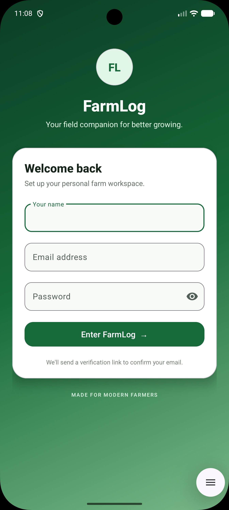
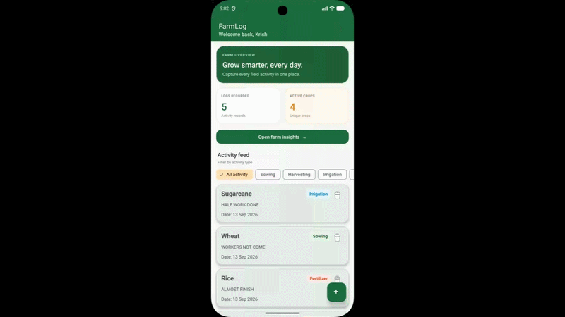
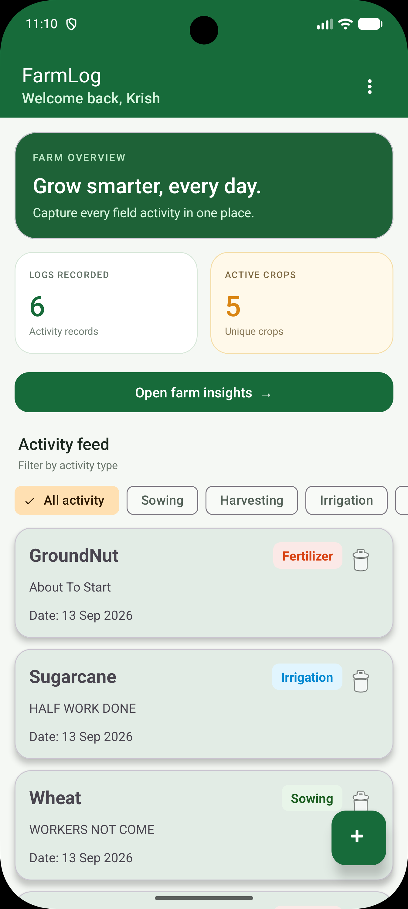
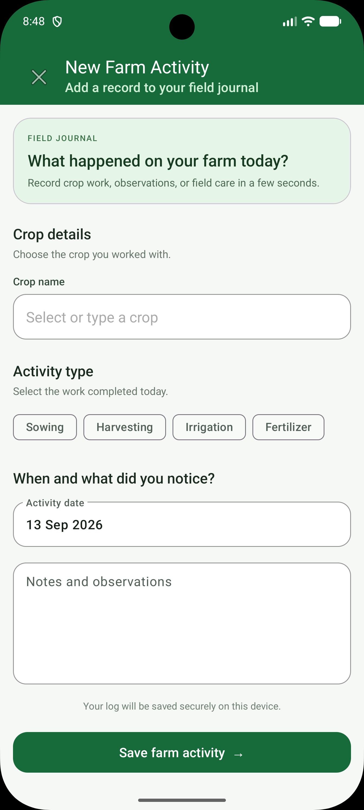
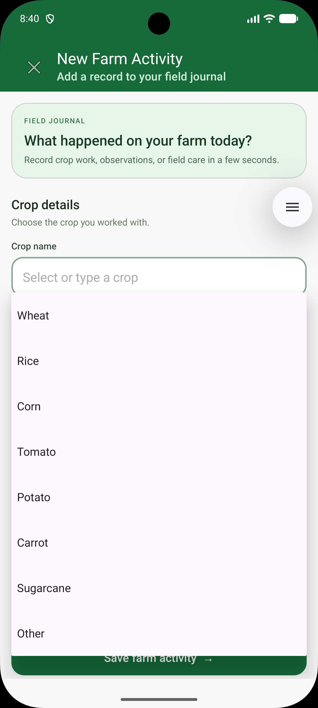
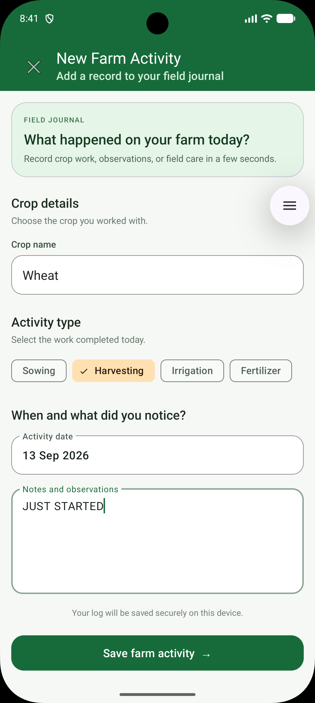
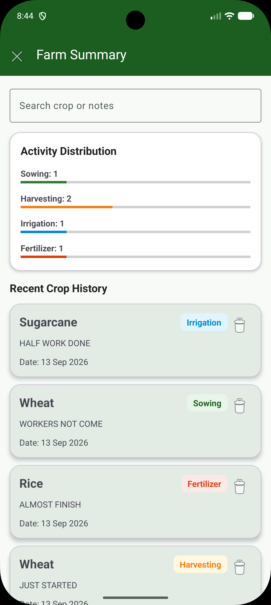
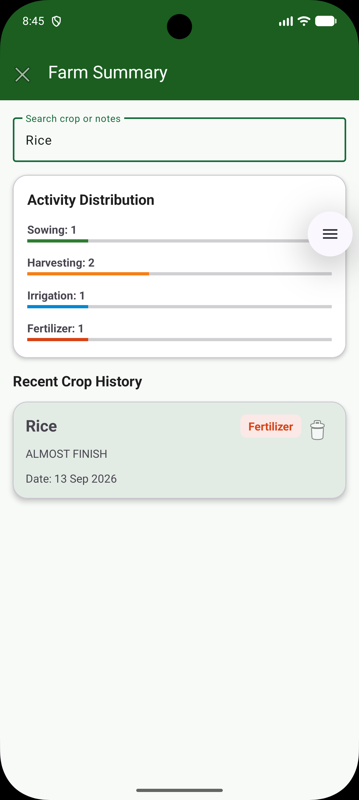

<p align="center">
  
</p>

<h1 align="center">🌿 FarmLog</h1>

<p align="center">
  <strong>Smart Farm Activity Manager</strong>
</p>

<p align="center">
  A modern Android application for recording, organising, and analysing daily farm activities.
</p>

<p align="center">
  
  
  
  
</p>

---

## ✨ About FarmLog

FarmLog is an Android application developed for a **Mobile Application Development** assignment. It helps farmers maintain a digital journal for crop activities such as sowing, harvesting, irrigation, and fertiliser application.

The application provides local user profiles, secure session persistence, activity management, filters, search, Farm Insights, and a modern agriculture-inspired user interface.

---

## 🎥 Full Application Demo

<p align="center">
  
</p>

<p align="center">
  <strong>FarmLog application flow: Login → Dashboard → Add Activity → Filters → Farm Insights → Logout</strong>
</p>

<p align="center">
  <a href="SCREEN/DEMO_FINAL.mp4">▶ Open the full MP4 demo video with sound</a>
</p>

> The GIF above plays automatically and loops continuously on GitHub. The MP4 link provides the full-quality video with sound.

---

## 🚀 Key Features

| Feature | Description |
|---|---|
| 🔐 Local Login | Login using name and email address |
| 👤 Multi-User Profiles | Each email address has separate farm records |
| 💾 Session Persistence | Logged-in users open directly to the dashboard |
| 🚪 Logout | Clears the current session and returns to Login |
| ➕ Add Activity | Save crop name, date, activity type, and notes |
| 🌾 Activity Types | Sowing, Harvesting, Irrigation, and Fertilizer |
| 🗂️ Smart Filters | Filter farm records by activity category |
| 📊 Farm Insights | View activity distribution and progress bars |
| 🔎 Search Records | Search using crop name, activity type, or notes |
| 🧹 Delete Activities | Remove unwanted farm activity records |
| 🎨 Premium UI | Green farming theme, animations, cards, and Material Design |
| 📱 Modern Layout | Handles device notch, status bar, and navigation bar safely |

---

## 📱 Application Flow

```text
Login Screen
     ↓
FarmLog Dashboard
     ↓
Add Farm Activity
     ↓
Save Activity in Room Database
     ↓
Dashboard and Farm Insights Update Automatically
```

### Local User Profile Flow

```text
Login with farmer1@gmail.com
           ↓
Shows only farmer1@gmail.com activities

Logout
           ↓
Login with farmer2@gmail.com
           ↓
Shows only farmer2@gmail.com activities

Login again with farmer1@gmail.com
           ↓
Earlier saved farm activities load automatically
```

> FarmLog uses the email address as a local profile ID. Each record is saved with its owner email, so users only see their own farm activities.

---

## 📸 Application Screens

<details open>
<summary><strong>View FarmLog screenshots</strong></summary>

<br>

<table>
  <tr>
    <td align="center">
      <a href="SCREEN/Login.png">
        
      </a>
      <br>
      <sub><b>Login Screen</b></sub>
    </td>
    <td align="center">
      <a href="SCREEN/SS1.png">
        
      </a>
      <br>
      <sub><b>Dashboard</b></sub>
    </td>
    <td align="center">
      <a href="SCREEN/SS2.png">
        
      </a>
      <br>
      <sub><b>Add Activity</b></sub>
    </td>
  </tr>
  <tr>
    <td align="center">
      <a href="SCREEN/SS3.png">
        
      </a>
      <br>
      <sub><b>Activity Filters</b></sub>
    </td>
    <td align="center">
      <a href="SCREEN/SS4.png">
        
      </a>
      <br>
      <sub><b>Farm Insights</b></sub>
    </td>
    <td align="center">
      <a href="SCREEN/SS5.png">
        
      </a>
      <br>
      <sub><b>Search and History</b></sub>
    </td>
  </tr>
  <tr>
    <td align="center">
      <a href="SCREEN/SS6.png">
        
      </a>
      <br>
      <sub><b>Additional Screen</b></sub>
    </td>
  </tr>
</table>

</details>

> Click any screenshot to view it in full size.

---

## 🛠️ Technology Stack

| Technology | Purpose |
|---|---|
| Kotlin | Main Android programming language |
| XML | User interface layouts |
| Android Studio | Development environment |
| Room Database | Local farm activity storage |
| SQLite | Database engine used by Room |
| MVVM | Application architecture pattern |
| ViewModel | Manages UI-related data |
| LiveData | Updates the UI when data changes |
| RecyclerView | Displays farm activity records |
| Material Components | Modern Android interface components |
| SharedPreferences | Stores login session information |

---

## 🏗️ Application Architecture

FarmLog follows the **MVVM (Model–View–ViewModel)** architecture.

```text
Activities and XML Layouts
Login | Dashboard | Add Activity | Insights
                    ↓
             FarmViewModel
                    ↓
                FarmDao
                    ↓
             Room Database
```

---

## 📂 Important Project Files

| File | Responsibility |
|---|---|
| `FarmLog.kt` | Defines the Room entity for a farm activity |
| `FarmDao.kt` | Contains Room database queries |
| `FarmDatabase.kt` | Configures the Room database |
| `FarmViewModel.kt` | Connects database data with the UI |
| `FarmLogAdapter.kt` | Displays activity records in RecyclerViews |
| `LoginActivity.kt` | Handles local login and saved sessions |
| `MainActivity.kt` | Displays the FarmLog dashboard |
| `AddLogActivity.kt` | Allows users to add farm activities |
| `SummaryActivity.kt` | Shows Farm Insights and statistics |

---

## ▶️ How to Run the Application

1. Open **Android Studio**.
2. Click **Open**.
3. Select the `MAD_24012011097_ASSIGNMENT` project folder.
4. Wait for **Gradle Sync** to complete.
5. Start an Android Emulator or connect an Android phone.
6. Click the green **Run ▶** button.
7. Enter your name and email address.
8. Add farm activities and open Farm Insights.

---

## 🧪 Testing Local User Profiles

1. Log in with:

   ```text
   farmer1@gmail.com
   ```

2. Add one or more farm activities.

3. Logout from the application.

4. Log in with:

   ```text
   farmer2@gmail.com
   ```

5. The dashboard is empty because this is a new local user profile.

6. Logout and log in again with:

   ```text
   farmer1@gmail.com
   ```

7. The earlier farm records load automatically.

---

## 🎯 Future Enhancements

- Firebase Authentication
- Firebase Firestore cloud backup
- Password-protected login
- Crop image upload
- Weather information integration
- Irrigation and fertiliser reminders
- Edit existing farm records
- Dark mode
- Export reports as PDF or CSV
- Multi-device data synchronisation

---

## 🎓 Project Information

| Item | Details |
|---|---|
| Project Name | FarmLog – Smart Farm Activity Manager |
| Platform | Android |
| Programming Language | Kotlin |
| Database | Room Database |
| Architecture | MVVM |
| Purpose | Mobile Application Development Assignment |

---

## 👨‍💻 Developer

**Name:** Krish Patel  
**Roll Number:** 24012011097  
**Course:** Mobile Application Development  

---

<p align="center">
  Made with 🌿 for smarter farm activity management.
</p>
